# Athleet - system do zgłaszania zawodników na zawody lekkoatletyczne  
## Autorzy: Szymon Paja i Tomasz Paja  
### Wstęp  
System pozwala na zgłaszanie zawodników na zawody lekkoatletyczne przez trenerów. Każdy trener może zgłaszać swoich zawodników na dostępne mityngi lekkoatletyczne i potwierdzać, bądź anulować te zgłoszenia.  
### Struktura bazy danych  
Baza danych jest bazą MongoDB, która składa się z pięciu kolekcji:
* Zawodnicy
* Trenerzy
* Zawody
* Zgloszenia
* Competition  

Omówimy po kolei każdą z nich.  
#### Kolekcja Zawodnicy  
Przechowuje dane osobowe zawodników oraz ich dane dotyczące wyników: rekordy życiowe, preferowane konkurencje. Przykładowy dokument tej bazy wygląda następująco:  
```js
{
    _id: ObjectId('6616713e2213e76670b2a77f'),
    firstname: 'Noah',
    lastname: 'Lyles',
    birthDate: ISODate('1997-07-18T00:00:00.000Z'),
    gender: 'male',
    nationality: 'United States',
    category: 'Senior',
    specialities: [
        '60m', '100m', '200m', '4x100m'
    ],
    personalRecordsShortTrack: {
        '60m': 6.43,
        '200m': 20.63,
        '300m': 31.87,
        '4x400m': 182.6
    },
    personalRecordsOutdoor: {
        '100m': 9.83,
        '200m': 19.31,
        '400m': 47.04,
        '4x100m': 37.1
    },
    coach: ObjectId("665a068a46fdea9886199dce")
}
```
Jak widać dokument przechowuje takie dane:  
* imię i nazwisko zawodnika - *firstname* i *lastname* (String)  
* datę urodzenia - *birthDate* (Date)  
* płeć - *gender* (String)  
* kraj pochodzenia - *nationality* (String)  
* kategorię wiekową - *category* (String)  
* konkurencje, w których zawodnik się specjalizuje - lista *specialities* (lista String)  
* rekordy życiowe na krótkim stadionie (200m obwodu) - obiekt *personal_records_short_track*: dla danej konkurencji podany jest wynik (String, Double)  
* rekordy życiowe na stadionie (400m obwodu) - obiekt *personal_records_outdoor*: dla danej konkurencji podany jest wynik (String, Double)  
* identyfikator trenera - *coach* (ObjectId)  
* nazwę klubu (**pole opcjonalne**) - *club* (String)  

#### Kolekcja Trenerzy  
Zawiera dane dotyczące trenerów - osobowe i te dotyczące dyscyplin, które trenują. Tak wygląda jeden z dokumentów tej kolekcji:  
```js
{
    _id: ObjectId('6616888e2213e76670b2a791'),
    firstname: 'Janusz',
    lastname: 'Mazurczak',
    nationality: 'Poland',
    club: 'CWKS Resovia Rzeszow',
    coaching: [
        'sprints', 'hurdles'
    ],
    athletes: [
        ObjectId('665e486365b83e53b4a75047'),
        ObjectId('665e64e465b83e5b10fce845')
    ]
}
```
Kolejne pozycje odpowiadają za:  
* imię i nazwisko trenera - *firstname* i *lastname* (String)  
* narodowość - *nationality* (String)  
* klub, do którego należy - *club* (String)  
* dyscypliny, które trenuje - lista *coaching* (lista String)  
* zawodników, których trener ma pod swoją opieką - lista *athletes* (lista ObjectId)  

#### Kolekcja Zawody  
Odpowiada za przechowywanie informacji o zawodach - o tym kiedy się odbywają, gdzie i jakich konkurencji można się na nich spodziewać. Jeden z jej dokumentów wygląda następująco:  
```js
{
    _id: ObjectId('66606b80bf0762225c21e468'),
    date: ISODate('2024-06-17T22:00:00.000Z'),
    city: 'Chorzow',
    name: '70. ORLEN Memorial Janusza Kusocinskiego',
    competitions: [
        ObjectId('66606b80bf0762225c21e45b'),
        ObjectId('66606b80bf0762225c21e45c'),
        ObjectId('66606b80bf0762225c21e45d'),
        ObjectId('66606b80bf0762225c21e45e'),
        ObjectId('66606b80bf0762225c21e460'),
        ObjectId('66606b80bf0762225c21e461'),
        ObjectId('66606b80bf0762225c21e462'),
        ObjectId('66606b80bf0762225c21e463'),
        ObjectId('66606b80bf0762225c21e464'),
        ObjectId('66606b80bf0762225c21e465'),
        ObjectId('66606b80bf0762225c21e466'),
        ObjectId('66606b80bf0762225c21e467')
    ]
  }
```
Pola oznaczają:  
* nazwę zawodów - *name* (String)  
* miasto, w którym się odbywają - *city* (String)  
* datę - *date* (Date)  
* listę konkurencji, które mają się odbyć w ramach tych zawodów - *competitions* (obiekt), która zawiera identyfikatory konkurencji (ObjectId) zawartych w kolekcji *Competition*  

#### Kolekcja Zgloszenia  
Jest to kolekcja przechowująca dokumenty zawierające najmniejszą liczbę danych, ale jakże ważnych - dotyczących zgłoszeń zawodników na zawody. Przykładowy dokument tej bazy wygląda następująco:  
```js
{
    _id: ObjectId('664e076ff269ff6bf5225ec0'),
    meetingId: ObjectId('66169321f5eb4896aa16c9b6'),
    competitorId: ObjectId('66165e1a2213e76670b2a778'),
    discipline: '100m M',
    status: 'confirmed'
}
```
Kolejne pola oznaczają:  
* identyfikator mityngu - *meetingId* (ObjectId)  
* identyfikator zawodnika - *competitorId* (ObjectId)  
* dyscyplinę, do której zawodnik jest zgłoszony - *discipline* (String)
* status zgłoszenia - *status* (String) - przyjmuje jedną z trzech wartości: *reported* - zgłoszony, *confirmed* - potwierdzony lub *cancelled* - anulowany.

#### Kolekcja Competition  
Przechowuje konkurencje dostępne we wszystkich wprowadzonych mityngach. Przykładowy dokument:  
```js
{
    _id: ObjectId('66606b80bf0762225c21e45b'),
    max_no_competitors: 8,
    discipline: "100m W"
}
```
Pola oznaczają:  
* maksymalną liczbę osób, które można zgłosić do konkurencji - *max_no_competitors*
* dyscyplinę - *discipline*  

### Klasy
W bazie danych korzystając z technologii Hibernate stworzyliśmy kilka klas odpowiadających między innymi wyżej wymienionym kolekcjom. Są to:

* zapisane w folderze *example.model*:
  * Athlete - odpowiadająca kolekcji *Zawodnicy*
  * Coach - odpowiadająca kolekcji *Trenerzy*
  * Meeting - odpowiadająca kolekcji *Zawody*
  * Report - odpowiadająca kolekcji *Zgloszenia*
  * Competition - odpowiadająca kolekcji *Competition*  
* zapisane w folderze *example.crud* klasy odpowiadające poszczególnym operacjom CRUD zawartym w nazwie klasy:
  * CrudCreate
  * CrudRead
  * CrudUpdate
  * CrudDelete
* zapisane w folderze *example*:
  * Main - klasa wykonywalna, w której tworzone są wszytkie operacje na bazie danych
  * HibernateUtil - klasa pomocnicza do operacji wykonywanych z użyciem technologii Hibernate

Poniżej zostaną przedstawione implementacje poszczególnych klas.

### Pliki konfiguracyjne Maven i Hibernate
Korzystamy z pliku mavenowskiego `pom.xml` i pliku konfiguracyjnego `persistence.xml`. Ich implementacje prezentują się następująco:  
`pom.xml`:
```xml
<project xmlns="http://maven.apache.org/POM/4.0.0"
         xmlns:xsi="http://www.w3.org/2001/XMLSchema-instance"
         xsi:schemaLocation="http://maven.apache.org/POM/4.0.0 http://maven.apache.org/xsd/maven-4.0.0.xsd">
    <modelVersion>4.0.0</modelVersion>

    <groupId>com.example</groupId>
    <artifactId>hibernate-mongodb-example</artifactId>
    <version>1.0-SNAPSHOT</version>

    <properties>
        <maven.compiler.source>21</maven.compiler.source>
        <maven.compiler.target>21</maven.compiler.target>
    </properties>

    <build>
        <plugins>
            <plugin>
                <groupId>org.apache.maven.plugins</groupId>
                <artifactId>maven-compiler-plugin</artifactId>
                <version>3.8.1</version>
                <configuration>
                    <source>21</source>
                    <target>21</target>
                </configuration>
            </plugin>
        </plugins>
    </build>

    <dependencies>
        <dependency>
            <groupId>org.hibernate</groupId>
            <artifactId>hibernate-core</artifactId>
            <version>5.3.10.Final</version>
        </dependency>
        <dependency>
            <groupId>org.hibernate.ogm</groupId>
            <artifactId>hibernate-ogm-mongodb</artifactId>
            <version>5.4.0.Final</version>
        </dependency>
        <dependency>
            <groupId>org.mongodb</groupId>
            <artifactId>mongodb-driver-sync</artifactId>
            <version>4.0.3</version>
        </dependency>
        <dependency>
            <groupId>javax.persistence</groupId>
            <artifactId>javax.persistence-api</artifactId>
            <version>2.2</version>
        </dependency>
        <dependency>
            <groupId>javax.xml.bind</groupId>
            <artifactId>jaxb-api</artifactId>
            <version>2.3.1</version>
        </dependency>
        <dependency>
            <groupId>org.glassfish.jaxb</groupId>
            <artifactId>jaxb-runtime</artifactId>
            <version>2.3.1</version>
        </dependency>
        <dependency>
            <groupId>javax.activation</groupId>
            <artifactId>activation</artifactId>
            <version>1.1.1</version>
        </dependency>
        <dependency>
            <groupId>org.projectlombok</groupId>
            <artifactId>lombok</artifactId>
            <version>RELEASE</version>
            <scope>compile</scope>
        </dependency>
        <dependency>
            <groupId>org.jetbrains</groupId>
            <artifactId>annotations</artifactId>
            <version>RELEASE</version>
            <scope>compile</scope>
        </dependency>
    </dependencies>
</project>
```
`persistence.xml` - zapisany w katalogu *resources/META-INF*:
```xml
<?xml version="1.0" encoding="UTF-8"?>
<persistence xmlns="http://xmlns.jcp.org/xml/ns/persistence"
             xmlns:xsi="http://www.w3.org/2001/XMLSchema-instance"
             xsi:schemaLocation="http://xmlns.jcp.org/xml/ns/persistence
                                 http://xmlns.jcp.org/xml/ns/persistence/persistence_2_2.xsd"
             version="2.2">

    <persistence-unit name="MongoDBPersistenceUnit" transaction-type="RESOURCE_LOCAL">
        <provider>org.hibernate.ogm.jpa.HibernateOgmPersistence</provider>
        <class>org.example.model.Athlete</class>
        <class>org.example.model.Coach</class>
        <class>org.example.model.Report</class>
        <class>org.example.model.Meeting</class>
        <class>org.example.model.Competition</class>
        <properties>
            <property name="hibernate.ogm.datastore.provider" value="MONGODB"/>
            <property name="hibernate.ogm.datastore.database" value="athleet"/>
            <property name="hibernate.ogm.datastore.host" value="localhost"/>
            <property name="hibernate.ogm.datastore.port" value="27017"/>
            <property name="hibernate.ogm.datastore.create_database" value="true"/>
            <property name="hibernate.ogm.mongodb.database" value="athleet"/>
            <property name="hibernate.ogm.mongodb.create_database" value="true"/>
        </properties>
    </persistence-unit>
</persistence>
```
### Struktura projektu
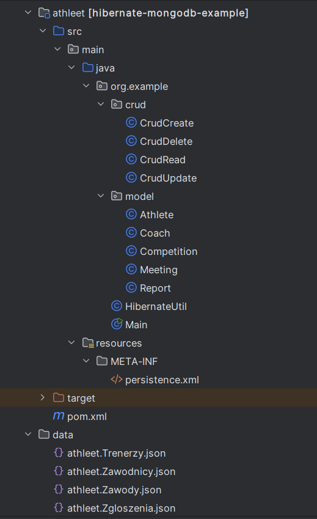
### Połączenie bazy MongoDB z Hibernate
Aby połączyć bazę zapisaną w MongoDB z technologią Hibernate skorzystaliśmy z plików konfiguracyjnych przedstawionych powyżej oraz z możliwości użycia bazy zapisanej w MongoDB w IntelliJ przedstawionej poniżej.
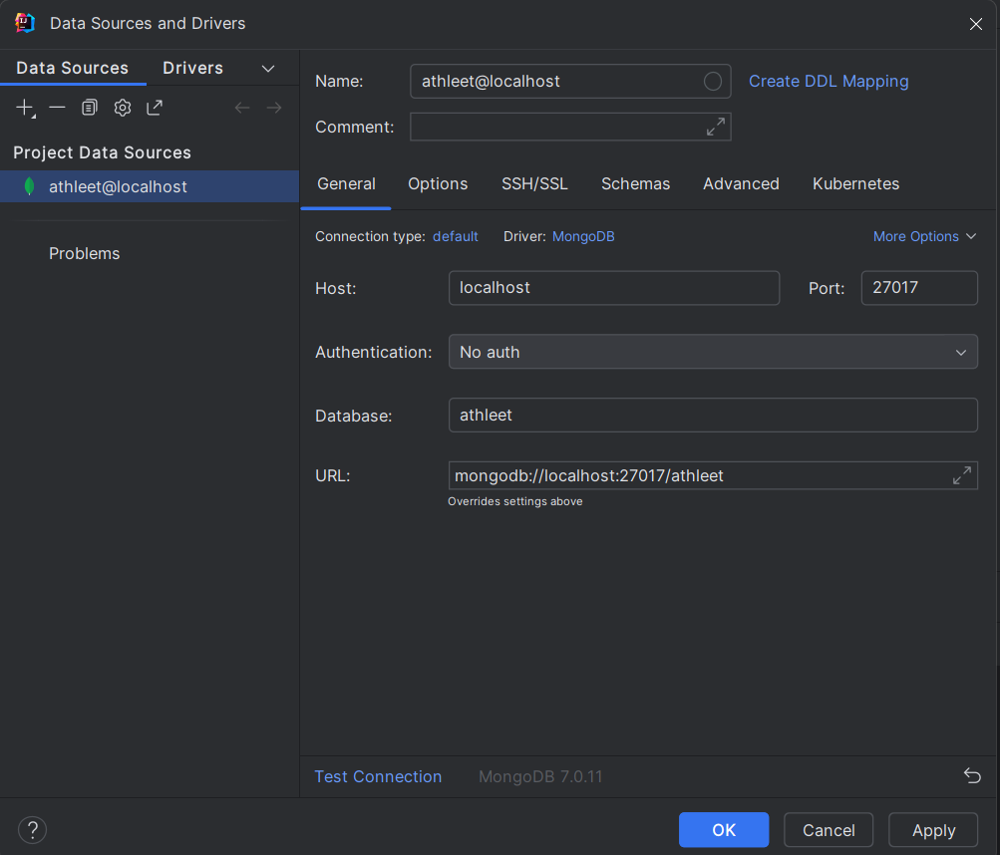

### Opis klas
1. Klasa *Athlete* - zawiera informacje na temat zawodnika. Każde pole tej klasy jest prywatne i ma automatycznie generowane gettery i settery (oprócz `Id`, które ma tylko getter), oznaczone przez
    ```java
    @Getter
    @Setter
    ```
    Ponadto pole:
    * `id` typu *ObjectId* - jest unikalnym identyfikatorem każdego zawodnika generowanym w konstruktorze klasy,
    * `firstname` typu *String* - jest imieniem zawodnika,
    * `lastname` typu *String* - jest nazwiskiem zawodnika,
    * `birthDate` typu *Date* - jest datą urodzenia zawodnika,
    * `gender` typu *String* - jest płcią zawodnika,
    * `nationality` typu *String* - jest narodowością zawodnika,
    * `category` typu *String* - jest kategorią wiekową, do której należy zawodnik, generowaną automatycznie przy tworzeniu zawodnika przy użyciu funkcji `convertBirthDateToCategory(Date date)`,
    * `club` typu *String* - jest nazwą klubu, do którego należy zawodnik,
    * `specialities` typu `List<String>` - jest dodatkowo oznaczone jako `@ElementCollection` i jest listą ulubionych konkurencji zawodnika,
    * `personalRecordsOutdoor` typu `Map<String, Double>` - jest mapą rekordów życiowych zawodnika osiąganych na stadionie (np. `100m, 9.99`) dodatkowo oznaczone:
        ```java
        @ElementCollection
        @CollectionTable(name = "PersonalRecordsOutdoor", joinColumns = @JoinColumn(name = "id"))
        @MapKeyColumn(name = "discipline")
        @Column(name = "record")
        ```
    * `personalRecordsShortTrack` typu `Map<String, Double>` - jest mapą rekordów życiowych zawodnika osiąganych na bieżni okrężnej o długości 200m; analogicznie jak pole wyżej, dodatkowo oznaczone:
        ```java
        @ElementCollection
        @CollectionTable(name = "PersonalRecordsShortTrack", joinColumns = @JoinColumn(name = "id"))
        @MapKeyColumn(name = "discipline")
        @Column(name = "record")
        ```
    * `coach` klasy *Coach* - jest obiektem oznaczającym trenera zawodnika, dodatkowo oznaczonym przez `@ManyToOne` z racji, że wielu zawodników może mieć tego samego trenera.
    Implementacja całej klasy:
    ```java
    package org.example.model;

    import lombok.Getter;
    import lombok.Setter;
    import org.bson.types.ObjectId;

    import javax.persistence.*;

    import java.util.*;

    @Entity
    @Table(name = "Zawodnicy")
    public class Athlete {
        @Getter
        @Id
        private ObjectId id;
        @Getter
        @Setter
        private String firstname;
        @Getter
        @Setter
        private String lastname;
        @Getter
        @Setter
        private Date birthDate;
        @Getter
        @Setter
        private String gender;
        @Getter
        @Setter
        private String nationality;
        @Getter
        @Setter
        private String category;
        @Getter
        @Setter
        private String club;
        @Getter
        @Setter
        @ElementCollection
        private List<String> specialities;
        @Getter
        @Setter
        @ElementCollection
        @CollectionTable(name = "PersonalRecordsOutdoor", joinColumns = @JoinColumn(name = "id"))
        @MapKeyColumn(name = "discipline")
        @Column(name = "record")
        private Map<String, Double> personalRecordsOutdoor;
        @Getter
        @Setter
        @ElementCollection
        @CollectionTable(name = "PersonalRecordsShortTrack", joinColumns = @JoinColumn(name = "id"))
        @MapKeyColumn(name = "discipline")
        @Column(name = "record")
        private Map<String, Double> personalRecordsShortTrack;

        @Getter
        @Setter
        @ManyToOne
        private Coach coach;

        public Athlete() {

        }

        public Athlete(String firstname, String lastname, Date birthDate, String gender, String nationality,
                        String club, List<String> specialities, Map<String, Double> personalRecordsOutdoor,
                        Map<String, Double> personalRecordsShortTrack, Coach coach) {
            this.id = new ObjectId();
            this.firstname = firstname;
            this.lastname = lastname;
            this.birthDate = birthDate;
            this.gender = gender;
            this.nationality = nationality;
            this.category = convertBirthDateToCategory(birthDate);
            this.club = club;
            this.specialities = specialities == null ? new ArrayList<>() : specialities;
            this.personalRecordsOutdoor = personalRecordsOutdoor == null ?
                new HashMap<>() : personalRecordsOutdoor;
            this.personalRecordsShortTrack = personalRecordsShortTrack == null ?
                new HashMap<>() : personalRecordsShortTrack;
            this.coach = coach;
        }

        public Athlete(String firstname, String lastname, String gender, String nationality, Coach coach) {
            this.id = new ObjectId();
            this.firstname = firstname;
            this.lastname = lastname;
            this.gender = gender;
            this.nationality = nationality;
            this.coach = coach;
        }

        private String personalRecordsShortTrackToString() {
            if (personalRecordsShortTrack == null)
                return "{}";
            String result = "{";
            for (String discipline: personalRecordsShortTrack.keySet())
                result += discipline + ": " + personalRecordsShortTrack.get(discipline) + ", ";
            result += "}";
            return result;
        }

        private String personalRecordsOutdoorToString() {
            if (personalRecordsOutdoor == null)
                return "{}";
            String result = "{";
            for (String discipline: personalRecordsOutdoor.keySet())
                result += discipline + ": " + personalRecordsOutdoor.get(discipline);
            result += "}";
            return result;
        }

        private String convertBirthDateToCategory(Date birthDate) {
            /**
            * @param birthDate
            * Function assign category to athlete depending on its birthdate.
            */
            Date currentDate = new Date();
            int differenceInYears = currentDate.getYear() - birthDate.getYear();
            if (differenceInYears < 16)
                return "Youngster";
            if (differenceInYears < 18)
                return "Younger junior";
            if (differenceInYears < 20)
                return "Junior";
            if (differenceInYears < 23)
                return "Youth";
            return "Senior";
        }

        @Override
        public String toString() {
            return "Athlete{" +
                    "id=" + id +
                    ", firstname='" + firstname + '\'' +
                    ", lastname='" + lastname + '\'' +
                    ", birthDate=" + birthDate +
                    ", gender='" + gender + '\'' +
                    ", nationality='" + nationality + '\'' +
                    ", category='" + category + '\'' +
                    ", club='" + club + '\'' +
                    ", specialities=" + specialities +
                    ", personalRecordsOutdoor=" + this.personalRecordsOutdoorToString() +
                    ", personalRecordsShortTrack=" + thhis.personalRecordsShortTrackToString() +
                    ", coach=" + coach.toStringWithoutAthletes() +
                    '}';
        }
    }
    ```
    Funkcja `personalRecordsOutdoorToString()` służy do wypisania na konsolę rekordów życiowych zawodnika osiąganych na stadionie.
    Funkcja `personalRecordsShortTrackToString()` służy do wypisania na konsolę rekordów życiowych zawodnika osiąganych na krótkim torze (z reguły w hali).  
    Funkcja `convertBirthDateToCategory(Date birthDate)` służy do przypisania odpowiedniej kategorii zawodnikowi bazując na jego dacie urodzenia.
3. Klasa *Coach* - zawiera informacje na temat trenera. Każde pole tej klasy jest prywatne i ma automatycznie generowane gettery i settery (oprócz `Id`, które ma tylko getter), oznaczone przez
    ```java
    @Getter
    @Setter
    ```
    Ponadto pole:
    * `id` typu *ObjectId* - jest unikalnym identyfikatorem każdego trenera generowanym w konstruktorze klasy,
    * `firstname` typu *String* - jest imieniem trenera,
    * `lastname` typu *String* - jest nazwiskiem trenera,
    * `nationality` typu *String* - jest narodowością trenera,
    * `club` typu *String* jest nazwą klubu, w którym trenuje trener,
    * `coaching` typu `List<String>` - jest listą typów konkurencji, które trenuje trener (np. `"sprints", "hurdles"`), dodatkowo oznaczone przez `@ElementCollection`,
    * `athletes` typu `List<Athlete>` - jest listą obiektów oznaczających zawodników, których trenuje trener, dodatkowo oznaczone przez `@OneToMany` z racji, że jeden trener może trenować wielu zawodników.
    Implementacja całej klasy:
    ```java
    package org.example.model;

    import lombok.Getter;
    import lombok.Setter;
    import org.bson.types.ObjectId;

    import javax.persistence.*;
    import java.util.ArrayList;
    import java.util.List;

    @Entity
    @Table(name = "Trenerzy")
    public class Coach {
        @Id
        @Getter
        private ObjectId id;
        @Getter
        @Setter
        private String firstname;
        @Getter
        @Setter
        private String lastname;
        @Getter
        @Setter
        private String nationality;
        @Getter
        @Setter
        private String club;
        @Getter
        @Setter
        @ElementCollection
        private List<String> coaching;

        @Getter
        @Setter
        @OneToMany
        private List<Athlete> athletes = new ArrayList<>();

        public Coach() {

        }

        public Coach(String firstname, String lastname, String nationality, String club, List<String> coaching,
                    List<Athlete> athletes) {
            this.id = new ObjectId();
            this.firstname = firstname;
            this.lastname = lastname;
            this.nationality = nationality;
            this.club = club;
            this.coaching = coaching == null ? new ArrayList<>() : coaching;
            this.athletes = athletes == null ? new ArrayList<>() : athletes;
        }

        public void addAthlete(Athlete athlete) {
            this.athletes.add(athlete);
        }

        @Override
        public String toString() {
            return "Coach{" +
                    "id=" + id +
                    ", firstname='" + firstname + '\'' +
                    ", lastname='" + lastname + '\'' +
                    ", nationality='" + nationality + '\'' +
                    ", club='" + club + '\'' +
                    ", coaching=" + coaching +
                    ", athletes=" + athletes +
                    '}';
        }

        public String toStringWithoutAthletes() {
            return "Coach{" +
                    "id=" + id +
                    ", firstname='" + firstname + '\'' +
                    ", lastname='" + lastname + '\'' +
                    ", nationality='" + nationality + '\'' +
                    ", club='" + club + '\'' +
                    ", coaching=" + coaching +
                    '}';
        }
    }
    ```
    Funkcja `addAthlete(Athlete athlete)` służy do dodawania zawodnika do listy zawodników trenowanych przez trenera.
4. Klasa *Meeting* - zawiera informacje na temat mityngu (zawodów). Każde pole tej klasy jest prywatne i ma automatycznie generowane gettery i settery (oprócz `Id`, które ma tylko getter), oznaczone przez
    ```java
    @Getter
    @Setter
    ```
    Ponadto pole:
    * `id` typu *ObjectId* - jest unikalnym identyfikatorem każdego mityngu generowanym w konstruktorze klasy,
    * `name` typu *String* - jest nazwą mityngu,
    * `city` typu *String* - jest nazwą miasta, w którym odbywa się mityng,
    * `date` typu *Date* - jest datą, kiedy odbywają się zawody,
    * `competitions` typu `List<Competition>` - jest listą obiektów klasy *Competition*, czyli konkurencji, które będą odbywały się na zawodach; dodatkowo oznaczona przez `@ElementCollection`.
    Implementacja całej klasy:
    ```java
    package org.example.model;

    import lombok.Getter;
    import lombok.Setter;
    import org.bson.types.ObjectId;
    import org.jetbrains.annotations.NotNull;

    import javax.persistence.*;
    import java.util.ArrayList;
    import java.util.Date;
    import java.util.List;

    @Entity
    @Table(name = "Zawody")
    public class Meeting {
        @Getter
        @Id
        private ObjectId id;
        @Getter
        @Setter
        private String name;
        @Getter
        @Setter
        private String city;
        @Getter
        @Setter
        private Date date;
        @Getter
        @Setter
        @OneToMany
        private List<Competition> competitions = new ArrayList<>();

        public Meeting() {

        }

        public Meeting(String name, String city, Date date, List<Competition> competitions) {
            this.id = new ObjectId();
            this.name = name;
            this.city = city;
            this.date = date;
            this.competitions = competitions == null ? new ArrayList<>() : competitions;
        }

        public void addCompetition(@NotNull Competition competition) {
            this.competitions.add(competition);
        }

        public void removeCompetition(@NotNull Competition competition) {
            this.competitions.remove(competition);
        }

        @Override
        public String toString() {
            return "Meeting{" +
                    "id=" + id +
                    ", name='" + name + '\'' +
                    ", city='" + city + '\'' +
                    ", date=" + date +
                    ", competitions=" + competitionsToString() +
                    '}';
        }

        private String competitionsToString() {
            if (competitions == null)
                return "{}";
            String result = "";
            for (Competition competition: competitions) {
                result += "{" + competition.toString() + "}, ";
            }
            return result;
        }
    }
    ```
    Funkcja `addCompetition(Competition competition)` służy do dodania konkurencji do listy konkurencji odbywających się na zawodach.
    Funkcja `removeCompetition(Competition competition)` służy do usunięcia konkurencji z listy konkurencji.
5. Klasa wbudowana *Competition* - zawiera informacje na temat konkurencji. Każde pole tej klasy jest prywatne i ma automatycznie generowane gettery i settery (oprócz `Id`, które ma tylko getter), oznaczone przez
    ```java
    @Getter
    @Setter
    ```
    Ponadto pole:
    * `id` typu *ObjectId* - jest unikalnym identyfikatorem każdej konkurencji generowanym w konstruktorze klasy,
    * `discipline` typu *String* - jest nazwą konkurencji,
    * `max_no_competitors` typu *int* - jest maksymalną liczbą zawodników, którzy mogą wziąć udział w danej konkurencji.
    Implementacja całej klasy:
    ```java
    package org.example.model;

    import lombok.Getter;
    import lombok.Setter;
    import org.bson.types.ObjectId;

    import javax.persistence.Embeddable;
    import javax.persistence.Id;

    @Embeddable
    public class Competition {
        @Getter
        @Id
        private ObjectId id;
        @Getter
        @Setter
        private String discipline;
        @Getter
        @Setter
        private int max_no_competitors;

        public Competition() {

        }

        public Competition(String discipline, int max_no_competitors) {
            this.id = new ObjectId();
            this.discipline = discipline;
            this.max_no_competitors = max_no_competitors;
        }

        @Override
        public String toString() {
            return "Competition{" +
                    "discipline='" + discipline + '\'' +
                    ", max_no_competitors=" + max_no_competitors +
                    '}';
        }
    }
    ```
6. Klasa *Report* - zawiera informacje na temat zgłoszeń zawodników do zawodów. Każde pole tej klasy jest prywatne i ma automatycznie generowane gettery i settery (oprócz `Id`, które ma tylko getter), oznaczone przez
    ```java
    @Getter
    @Setter
    ```
    Ponadto pole:
    * `id` typu *ObjectId* - jest unikalnym identyfikatorem każdego zgłoszenia generowanym w konstruktorze klasy,
    * `meeting` klasy *Meeting* - jest obiektem oznaczającym mityng, do którego zgłoszony jest zawodnik ze zgłoszenia, dodatkowo oznaczone przez `@ManyToOne` z racji, że może być wiele zgłoszeń do jednego mityngu,
    * `athlete` klasy *Athlete* - jest obiektem oznaczającym zawodnika, który jest zgłaszany danym zgłoszeniem, dodatkowo oznaczone przez `@ManyToOne` z racji, że jeden zawodnik może byc wiele razy zgłaszany do różnych zawodów,
    * `coach` klasy *Coach* - jest obiektem oznaczającym trenera, który zgłasza zawodnika danym zgłoszeniem, dodatkowo oznaczone przez `@ManyToOne` z racji, że jeden trener może wiele razy zgłaszać do zawodów swoich zawodników,
    * `discipline` typu *String* - jest nazwą konkurencji, do której zgłaszany jest zawodnik danym zgłoszeniem,
    * `status` typu *String* - jest statusem zgłoszenia i może przyjmować trzy wartości
      * *reported* - oznacza, że zawodnik jest zgłoszony do zawodów,
      * *confirmed* - oznacza, że start zawodnika jest potwierdzony,
      * *cancelled* - oznacza, że zgłoszenie jest anulowane i zawodnik nie wystartuje w zawodach,
    * `date` typu *Date* - jest datą zgłoszenia.
    Implementacja całej klasy:
    ```java
    package org.example.model;

    import lombok.Getter;
    import lombok.Setter;
    import org.bson.types.ObjectId;

    import javax.persistence.Entity;
    import javax.persistence.Id;
    import javax.persistence.ManyToOne;
    import javax.persistence.Table;
    import java.util.Date;

    @Entity
    @Table(name = "Zgloszenia")
    public class Report {
        @Getter
        @Id
        private ObjectId id;
        @Getter
        @Setter
        @ManyToOne
        private Meeting meeting;
        @Getter
        @Setter
        @ManyToOne
        private Athlete athlete;
        @Getter
        @Setter
        @ManyToOne
        private Coach coach;
        @Getter
        @Setter
        private String discipline;
        @Getter
        @Setter
        private String status;
        @Getter
        @Setter
        private Date date;

        public Report() {

        }

        public Report(Meeting meeting, Athlete athlete, Coach coach, String discipline, boolean isConfirmed, Date date)
        {
            this.id = new ObjectId();
            this.meeting = meeting;
            this.athlete = athlete;
            this.coach = coach;
            this.discipline = discipline;
            this.status = isConfirmed ? "confirmed" : "reported";
            this.date = date;
        }
    }
    ```
7. Klasa *HibernateUtil* - jest klasą pomocniczą do klasy *Main*, a jej implementacja wygląda następująco:
   ```java
   package org.example;

    import javax.persistence.EntityManagerFactory;
    import javax.persistence.Persistence;

    public class HibernateUtil {
        private static final String PERSISTENCE_UNIT_NAME = "MongoDBPersistenceUnit";
        private static EntityManagerFactory factory;

        public static EntityManagerFactory getEntityManagerFactory() {
            if (factory == null) {
                factory = Persistence.createEntityManagerFactory(PERSISTENCE_UNIT_NAME);
            }
            return factory;
        }

        public static void shutdown() {
            if (factory != null) {
                factory.close();
            }
        }
    }
   ```
8. Klasa *Main* - jest klasą wykonywalną, której implementacja zmienia się w zależności, jakie operacje chcemy przeprowadzić na bazie danych, ale z grubsza wygląda tak:
   ```java
   package org.example;

    import org.example.crud.CrudCreate;
    import org.example.crud.CrudRead;
    import org.example.model.*;

    import javax.persistence.EntityManager;
    import javax.persistence.EntityManagerFactory;
    import javax.persistence.NoResultException;
    import java.util.Calendar;
    import java.util.Date;
    import java.util.List;
    import java.util.Map;

    public class Main {
        private static EntityManagerFactory entityManagerFactory = HibernateUtil.getEntityManagerFactory();
        public static EntityManager entityManager = entityManagerFactory.createEntityManager();

        public static void main(String[] args) {

            EntityManagerFactory entityManagerFactory = HibernateUtil.getEntityManagerFactory();
            EntityManager entityManager = entityManagerFactory.createEntityManager();

            // Tutaj wykonujemy operacje na bazie danych...

            HibernateUtil.shutdown();
        }

       private static Athlete getAthlete(EntityManager entityManager, String firstname, String lastname)
       {
            Athlete athlete = null;
            try {
                athlete = (Athlete) entityManager.createQuery(
                                "FROM Athlete a WHERE a.firstname = :firstname AND " +
                                "a.lastname = :lastname")
                        .setParameter("firstname", firstname)
                        .setParameter("lastname", lastname)
                        .getSingleResult();
            } catch (NoResultException ignored) {
    
            }
            return athlete;
        }
    
        private static Meeting getMeeting(EntityManager entityManager, String meetingName) {
            Meeting meeting = null;
            try {
                meeting = (Meeting) entityManager.createQuery(
                                "FROM Meeting m WHERE m.name = :name")
                        .setParameter("name", meetingName)
                        .getSingleResult();
            } catch (NoResultException ignored) {
    
            }
            return meeting;
        }
    
        private static Report getReport(EntityManager entityManager, Meeting meeting, Athlete athlete,
                                        Coach coach, String discipline) {
            Report result = null;
            try {
                result = (Report) entityManager.createQuery(
                                "FROM Report r WHERE r.meeting = :meeting AND " +
                                "r.athlete = :athlete AND " +
                                "r.coach = :coach AND " +
                                "r.discipline = :discipline")
                        .setParameter("meeting", meeting)
                        .setParameter("athlete", athlete)
                        .setParameter("coach", coach)
                        .setParameter("discipline", discipline)
                        .getSingleResult();
            } catch (NoResultException ignored) {
    
            }
            return result;
        }
    
        private static Coach getCoach(EntityManager entityManager, String firstname, String lastname) {
            Coach coach = null;
            try {
                coach = (Coach) entityManager.createQuery(
                                "FROM Coach c WHERE c.firstname = :firstname AND " +
                                "c.lastname = :lastname")
                        .setParameter("firstname", firstname)
                        .setParameter("lastname", lastname)
                        .getSingleResult();
            } catch (NoResultException ignored) {
    
            }
            return coach;
        }
    
        private static Competition getCompetition(EntityManager entityManager, String discipline,
                                                    int max_no_competitors) {
            Competition competition = null;
            try {
                competition = (Competition) entityManager.createQuery(
                        "FROM Competition c WHERE c.discipline = :discipline AND " +
                        "c.max_no_competitors = :max_no_competitors")
                        .setParameter("discipline", discipline)
                        .setParameter("max_no_competitors", max_no_competitors)
                        .getSingleResult();
            } catch (NoResultException ignored) {
    
            }
            return competition;
        }
    }
   ```
Funkcje *getAthlete*, *getCoach*, *getReport*, *getMeeting* oraz *getCompetition* są funkcjami pomocniczymi pozwalającymi na łatwe znalezienie konkretnego obiektu w bazie.  

### Operacje CRUD dostępne w bazie  

#### Operacje Create - klasa *CrudCreate*  
Sama klasa wygląda następująco:  
```java
import org.jetbrains.annotations.NotNull;

import javax.persistence.EntityManager;
import javax.persistence.NoResultException;
import javax.transaction.Transactional;
import java.util.Date;
import java.util.List;

public class CrudCreate {
    private EntityManager entityManager;

    public CrudCreate(EntityManager entityManager) {
        this.entityManager = entityManager;
    }

    // Funkcje tworzące poszczególne obiekty, opisane dokładnie poniżej.

}
```
Przyjmuje ona w konstruktorze parametr *entityManager*, który jest głównym menedżerem bazy i odpowiada za wprowadzanie w niej zmian.  

1. Funkcja tworząca zawodnika - `createAthlete`:  
```java
@Transactional
public Athlete createAthlete(@NotNull String firstname, @NotNull String lastname, @NotNull Date birthDate,
                            @NotNull String gender, String nationality, String club,
                            List<String> specialities, Map<String, Double> personalRecordsOutdoor,
                            Map<String, Double> personalRecordsShortTrack, @NotNull Coach coach) {
    /**
     * Creates athlete and returns it.
     */
    Athlete athlete = new Athlete(firstname, lastname, birthDate, gender, nationality, club,
                                    specialities, personalRecordsOutdoor,
                                    personalRecordsShortTrack, coach);
    entityManager.getTransaction().begin();
    entityManager.persist(athlete);
    entityManager.getTransaction().commit();
    return athlete;
}
```
Funkcja tworzy nowego zawodnika na podstawie przekazanych danych:  
Po wykonaniu takiego fragmentu kodu w funkcji *Main*:  
```java
CrudCreate crudCreate = new CrudCreate(entityManager);
Coach coach = entityManager.createQuery("FROM Coach", Coach.class).setMaxResults(1).getSingleResult();
        
System.out.println("Coach before creating an athlete:");
System.out.println(coach.toString());
        
Athlete athlete = crudCreate.createAthlete("Wieslaw", "Przystojny",
        new Date(75, Calendar.DECEMBER, 12), "male", "Poland", "SKLA Sopot", null, null, null, coach);

Athlete foundAthlete = entityManager.find(Athlete.class, athlete.getId());

System.out.println("Found created athlete and coach after adding an athlete:");
System.out.println(foundAthlete.toString());
System.out.println(coach.toString());
```
otrzymamy takie wyniki:  

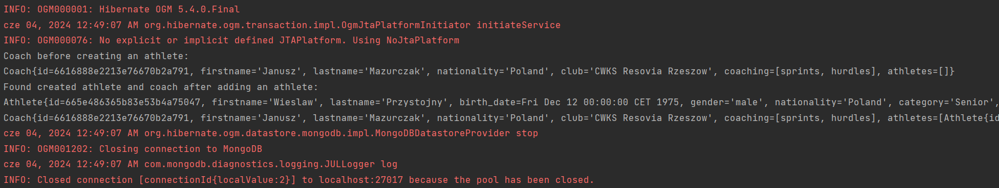  

Obiekt `foundAthlete` to nic innego jak utworzony zawodnik. Operacja dostarczająca dane do tej zmiennej potwierdza tylko fakt, iż zawodnik został dodany do bazy, a zapewniają to komendy `entityManager.getTransaction().begin()`, która 'otwiera' transakcję, oraz `entityManager.getTransaction().commit()` aktualizująca bazę danych. Bez tych komend obiekt zostanie utworzony i znaleziony, ale nie zostanie zapisany na stałe do bazy (o czym przekonaliśmy się podczas próby usunięcia tych komend).  
Jak widać przed utworzeniem zawodnika, lista zawodników trenera Janusza Mazurczaka była pusta, a po tej operacji dodał się nowy zawodnik. Może pokażemy to dokładniej:  
```js
Coach before creating an athlete:
Coach {
    id=6616888e2213e76670b2a791, firstname='Janusz', lastname='Mazurczak', nationality='Poland',
    club='CWKS Resovia Rzeszow', coaching=[sprints, hurdles], athletes=[]
}

Found created athlete and coach after adding an athlete:
Athlete {
    id=665e486365b83e53b4a75047, firstname='Wieslaw', lastname='Przystojny',
    birthDate=Fri Dec 12 00:00:00 CET 1975, gender='male', nationality='Poland',
    category='Senior', club='SKLA Sopot', specialities=[], personalRecordsOutdoor={},
    personalRecordsShortTrack={},
    coach=Coach {
        id=6616888e2213e76670b2a791, firstname='Janusz', lastname='Mazurczak', nationality='Poland',
        club='CWKS Resovia Rzeszow', coaching=[sprints, hurdles]
    }
}

Coach {
    id=6616888e2213e76670b2a791, firstname='Janusz', lastname='Mazurczak', nationality='Poland',
    club='CWKS Resovia Rzeszow', coaching=[sprints, hurdles],
    athletes=[
        Athlete{
            id=665e486365b83e53b4a75047, firstname='Wieslaw', lastname='Przystojny',
            birthDate=Fri Dec 12 00:00:00 CET 1975, gender='male', nationality='Poland',
            category='Senior', club='SKLA Sopot', specialities=[], personalRecordsOutdoor={},
            personalRecordsShortTrack={},
            coach=Coach{
                id=6616888e2213e76670b2a791, firstname='Janusz', lastname='Mazurczak',
                nationality='Poland', club='CWKS Resovia Rzeszow', coaching=[sprints, hurdles]
            }
        }
    ]
}
```
Drugi przykład dodania zawodnika (pominąłem większość danych w wypisywaniu danych o zwodnikach trenera):  
```js
Coach before creating an athlete:
Coach{
    id=6616888e2213e76670b2a791, firstname='Janusz', lastname='Mazurczak', nationality='Poland',
    club='CWKS Resovia Rzeszow', coaching=[sprints, hurdles],
    athletes=[
        Athlete{
            id=665e486365b83e53b4a75047, firstname='Wieslaw', lastname='Przystojny',
            /* Pozostałe dane zawodnika */
        }
    ]
}

Found created athlete and coach after adding an athlete:
Athlete{
    id=665e4ab065b83e4ebc9324cd, firstname='Oliwer', lastname='Wowik',
    birthDate=Sun Nov 10 00:00:00 CET 2002, gender='male', nationality='Poland', category='Youth',
    club='CWKS Resovia Rzeszow', specialities=[sprints],
    personalRecordsOutdoor={200m: 20.96, 100m: 10.23}, personalRecordsShortTrack={},
    coach=Coach{
        id=6616888e2213e76670b2a791, firstname='Janusz', lastname='Mazurczak', nationality='Poland',
        club='CWKS Resovia Rzeszow', coaching=[sprints, hurdles]
    }
}

Coach{
    id=6616888e2213e76670b2a791, firstname='Janusz', lastname='Mazurczak', nationality='Poland',
    club='CWKS Resovia Rzeszow', coaching=[sprints, hurdles],
    athletes=[
        Athlete{
            id=665e486365b83e53b4a75047, firstname='Wieslaw', lastname='Przystojny',
            /* Pozostałe dane zawodnika */
        },
        Athlete{
            id=665e4ab065b83e4ebc9324cd, firstname='Oliwer', lastname='Wowik',
            /* Pozostałe dane zawodnika */
        }
    ]
}
```


2. Funkcja tworząca trenera - `createCoach`:  
```java
@Transactional
public Coach createCoach(@NotNull String firstname, @NotNull String lastname, String nationality,
                        @NotNull String club, List<String> coaching, List<Athlete> athletes) {
    /**
     * Creates coach and returns it.
     */
    Coach coach = new Coach(firstname, lastname, nationality, club, coaching, athletes);
    entityManager.getTransaction().begin();
    entityManager.persist(coach);
    entityManager.getTransaction().commit();
    return coach;
}
```
Zasada działania tej funkcji jest identyczna jak zasada działania funkcji `createAthlete`.  
Przykład:  
```java
CrudCreate crudCreate = new CrudCreate(entityManager);
Coach coach = crudCreate.createCoach("Tomasz", "Saksa", "Poland", "AZS-AWF Gorzow Wielkopolski",
                                        List.of("sprints", "jumps"), null);

Coach foundCoach = entityManager.find(Coach.class, coach.getId());
System.out.println("New coach:");
System.out.println(foundCoach.toString());
```
Wynik:  

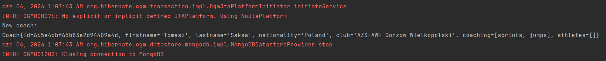  

Jak widać trener został dodany do bazy danych.  

3. Funkcja tworząca zawody - `createMeeting`:  
```java
public Meeting createMeeting(@NotNull String name, @NotNull String city, @NotNull Date date,
                            List<Competition> competitions) {
    /**
     * Creates meeting and returns it.
     */
    List<Meeting> allMeetings = new CrudRead(entityManager).getAllMeetings();
    for (Meeting meeting: allMeetings) {
        if (meeting.getName().equals(name))
            return meeting;
    }
    Meeting meeting = new Meeting(name, city, date, competitions);
    for (Competition competition : competitions) {
        if (competition.getId() == null) {
            entityManager.persist(competition);
        } else {
            entityManager.merge(competition);
        }
    }
    entityManager.getTransaction().begin();
    entityManager.persist(meeting);
    entityManager.getTransaction().commit();
    return meeting;
}
```
Jej zadaniem jest stworzenie nowych zawodów z daną listą konkurencji (*competitions*), która może być pusta - później można dodać konkurencję do zawodów za pomocą funkcji `addCompetitionToMeeting`, która będzie opisana później.  
Przykładowe wywołanie:  
```java
CrudCreate crudCreate = new CrudCreate(entityManager);
System.out.println("Number of meetings before creating: " +
                    entityManager.createQuery("FROM Meeting").getResultList().size());

Meeting meeting = crudCreate.createMeeting(
                "20. Otwarte Mistrzostwa Przemysla", "Przemysl",
                new Date(124, Calendar.MAY, 18),
                List.of(crudCreate.createCompetition("100m M", 8),
                        crudCreate.createCompetition("100m W", 8),
                        crudCreate.createCompetition("200m M", 16),
                        crudCreate.createCompetition("200m W", 16),
                        crudCreate.createCompetition("Discus throw M", 8),
                        crudCreate.createCompetition("Discus throw W", 8),
                        crudCreate.createCompetition("800m M", 14),
                        crudCreate.createCompetition("800m M", 14))
);

Meeting foundMeeting = entityManager.find(Meeting.class, meeting.getId());
System.out.println("New meeting:");
System.out.println(foundMeeting.toString());
System.out.println("Number of meetings after creating: " +
                    entityManager.createQuery("FROM Meeting").getResultList().size());
```
Wynik:  

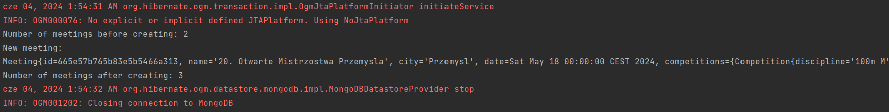  

Spróbujmy znaleźć ten mityng w nowym zapytaniu, aby potwierdzić obecność tego mityngu w bazie:  
```java
List<Meeting> meetings = entityManager.createQuery(
                "FROM Meeting m WHERE m.name = :name", Meeting.class)
                .setParameter("name", "20. Otwarte Mistrzostwa Przemysla").getResultList();
System.out.println(meetings.size());
System.out.println(meetings.get(0).toString());
```
Wynik prezentuje się następująco:  

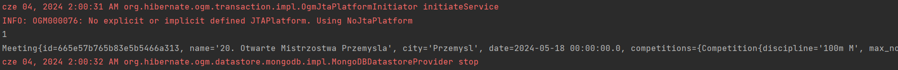
Dokładniej:  
```js
1
Meeting{
    id=665e57b765b83e5b5466a313, name='20. Otwarte Mistrzostwa Przemysla', city='Przemysl',
    date=2024-05-18 00:00:00.0,
    competitions={
        Competition{
            discipline='100m M', max_no_competitors=8
        },
        Competition{
            discipline='100m W', max_no_competitors=8
        },
        Competition{
            discipline='200m M', max_no_competitors=16
        },
        Competition{
            discipline='200m W', max_no_competitors=16
        },
        Competition{
            discipline='Discus throw M', max_no_competitors=8
        },
        Competition{
            discipline='Discus throw W', max_no_competitors=8
        },
        Competition{
            discipline='800m M', max_no_competitors=14
        }
    }
}
```
Można zauważyć, że konkurencja 800m M została dodana tylko raz, mimo że w liście występowała dwa razy - po prostu od razu zredukowała się redundantna kopia tej konkurencji.  

4. Funkcja tworząca zgłoszenie - `createReport`  
```java
@Transactional
public Report createReport(@NotNull Meeting meeting, @NotNull Athlete athlete, @NotNull Coach coach,
                            @NotNull String discipline, @NotNull boolean isConfirmed) {
    /**
     * Returns report if it is possible to create, that is:
     * * an athlete is being reported to the competition which is held for its gender,
     * * there is a place for an athlete in the competition
     *   (that is there are less than max_no_competitors athletes reported or confirmed).
     */
    if (!compareGenderAndCompetition(athlete, discipline)) {
        System.out.println("You cannot assign an athlete to discipline specified for another gender!");
        return null;
    }
    CrudRead crudRead = new CrudRead(entityManager);
    List<Meeting> meetings = crudRead.getAllMeetings();
    if (!meetings.contains(meeting)) {
        System.out.println("There is no such meeting in the database!");
        return null;
    }
    if (meeting.getDate().before(new Date())) {
        System.out.println("You cannot report an athlete for this meeting," +
                            "because this meeting has already taken place!");
        return null;
    }
    List<Competition> competitions = crudRead.getAllMeetingCompetitions(meeting);
    int max_no_participants = 0;
    for (Competition competition: competitions) {
        if (competition.getDiscipline().equals(discipline)) {
            max_no_participants = competition.getMax_no_competitors();
            break;
        }
    }
    if (max_no_participants == -1) {
        System.out.println("There is no such discipline in this meeting!");
        return null;
    }
    if (crudRead.getReportsOfAllNotCancelledAthletesParticipatingInMeetingInDiscipline(
            meeting, discipline
        ).size() >= max_no_participants) {
        System.out.println("There are no places left for this competition!");
        return null;
    }
    Report check = null;
    try {
        check = (Report) entityManager.createQuery(
                        "FROM Report r WHERE r.meeting = :meeting AND r.athlete = :athlete AND " +
                        "r.coach = :coach AND r.discipline = :discipline")
                .setParameter("meeting", meeting)
                .setParameter("athlete", athlete)
                .setParameter("coach", coach)
                .setParameter("discipline", discipline)
                .getSingleResult();
    } catch (NoResultException ignored) {

    }
    if (check != null) {
        System.out.println("The report of this athlete to this competition already exists!");
        return check;
    }
    Report report = new Report(meeting, athlete, coach, discipline, isConfirmed, new Date());
    entityManager.getTransaction().begin();
    entityManager.persist(report);
    entityManager.getTransaction().commit();
    return report;
}
```
Raport zostanie utworzony tylko wówczas, gdy zostaną spełnione poniższe warunki:  
* zawodnik jest zgłaszany do konkurencji zgodnej z jego płcią (tzn. jeśli wartość `gender` jest *male*, to zgoda wystąpi, jeśli konkurencja kończy się sufiksem *M*, zaś jeśli `gender` przyjmuje *female*, to konkurencja musi kończyć się sufiksem *W*)  
* czy istneje dana konkurencja w ramach danych zawodów  
* jest jeszcze miejsce dla zawodnika na zawodach, to znaczy jest mniej zawodników o statusie *reported* bądź *confirmed* do danej dyscypliny na danych zawodach niż pozwala na to limit `max_no_competitors` w tej konkurencji.  

Funkcje pomocnicze sprawdzające te warunki wyglądają następująco (funkcja sprawdzająca drugi warunek znajduje się w klasie `CrudRead`):  
```java
private boolean compareGenderAndCompetition(Athlete athlete, String discipline) {
    return (athlete.getGender().equals("male") && discipline.endsWith("M"))
            || (athlete.getGender().equals("female") && discipline.endsWith("W"));
}

public List<Report> getReportsOfAllNotCancelledAthletesParticipatingInMeetingInDiscipline(
                    @NotNull Meeting meeting, @NotNull String discipline) {
    
    List<Report> allReportsInThisCompetitionInThisMeeting =
        getReportsOfAllAthletesParticipatingInMeetingInDiscipline(meeting, discipline);
    
    List<Report> results = new ArrayList<>();
    for (Report report: allReportsInThisCompetitionInThisMeeting) {
        if (!report.getStatus().equals("cancelled"))
            results.add(report);
    }
    return results;
}
```
Dodanie raportu do wyżej dodanych zawodów wygląda w ten sposób:  
```java
CrudCreate crudCreate = new CrudCreate(entityManager);
Meeting meeting = (Meeting) entityManager.createQuery(
    "FROM Meeting m WHERE m.name = :name")
    .setParameter("name", "20. Otwarte Mistrzostwa Przemysla")
    .getResultList().get(0);
Athlete athlete1 = (Athlete) entityManager.createQuery(
    "FROM Athlete a WHERE a.firstname = :firstname AND a.lastname = :lastname")
    .setParameter("firstname", "Tomasz")
    .setParameter("lastname", "Paja")
    .getResultList().get(0);
Athlete athlete2 = (Athlete) entityManager.createQuery(
    "FROM Athlete a WHERE a.firstname = :firstname AND a.lastname = :lastname")
    .setParameter("firstname", "Szymon")
    .setParameter("lastname", "Paja")
    .getResultList().get(0);
Coach coach = (Coach) entityManager.createQuery(
    "FROM Coach c WHERE c.firstname = :firstname AND c.lastname = :lastname")
    .setParameter("firstname", "Piotr")
    .setParameter("lastname", "Kowalski")
    .getResultList().get(0);
Report report = crudCreate.createReport(meeting, athlete1, coach, "800m W", false);
Report report1 = crudCreate.createReport(meeting, athlete1, coach, "800m M", false);
Report report2 = crudCreate.createReport(meeting, athlete2, coach, "800m M", true);
```
Wyniki:  

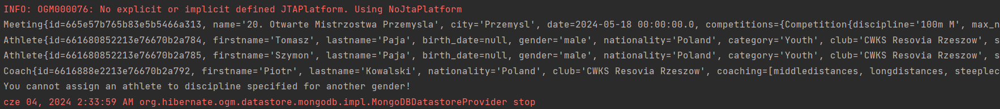  
Tutaj dodatkowo wyświetliliśmy dane dotyczące zawodników, zawodów i trenera, aby mieć pewnosć, że te encje instnieją w bazie danych.  
Po wykonaniu powyższych komend pokażemy wszystkie zgłoszenia do tych zawodów, korzystając z funkcji `getReportsOfAllAthletesParticipatingInMeeting` (będzie ona szczegółowo opisana w dalszej części raportu), aby łatwo zobaczyć wszystkie zgłoszenia.  
```java
Meeting meeting = (Meeting) entityManager.createQuery(
    "FROM Meeting m WHERE m.name = :name")
    .setParameter("name", "20. Otwarte Mistrzostwa Przemysla")
    .getResultList().get(0);

List<Report> reports = crudRead.getReportsOfAllAthletesParticipatingInMeeting(meeting);
System.out.println(reports.size());
for (Report report: reports)
    System.out.println(report.toString());
```
Wyniki:  

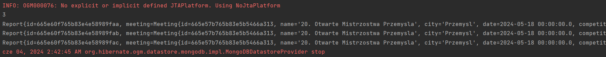  
Widać, że są to tylko te trzy zgłoszenia, które były dodane wyżej (ze względu na to, że zawody są nowe nie zostało utworzone więcej zgłoszeń). Dokładnie wyglądają tak:  
```js
3
Report{
    id=665e60f765b83e4e58989faa,
    meeting=Meeting{
        id=665e57b765b83e5b5466a313, name='20. Otwarte Mistrzostwa Przemysla', city='Przemysl',
        /* Pozostałe dane zawodów */
    },
    athlete=Athlete{
        id=661680852213e76670b2a784, firstname='Tomasz', lastname='Paja',
        /* Pozostałe dane zawodnika */
    },
    coach=Coach{
        id=6616888e2213e76670b2a792, firstname='Piotr', lastname='Kowalski',
        /* Pozostałe dane trenera */
    },
    discipline='800m M', status='reported', date=2024-06-04 02:33:59.786
}

Report{
    id=665e60f765b83e4e58989fab,
    meeting=Meeting{
        id=665e57b765b83e5b5466a313, name='20. Otwarte Mistrzostwa Przemysla', city='Przemysl',
        /* Pozostałe dane zawodów */
    },
    athlete=Athlete{
        id=661680852213e76670b2a785, firstname='Szymon', lastname='Paja',
        /* Pozostałe dane zawodnika */
    },
    coach=Coach{
        id=6616888e2213e76670b2a792, firstname='Piotr', lastname='Kowalski',
        /* Pozostałe dane trenera */
    },
    discipline='800m M', status='confirmed', date=2024-06-04 02:33:59.843
}

Report{
    id=665e60f765b83e4e58989fac,
    meeting=Meeting{
        id=665e57b765b83e5b5466a313, name='20. Otwarte Mistrzostwa Przemysla', city='Przemysl',
        /* Pozostałe dane zawodów */
    },
    athlete=Athlete{
        id=661680852213e76670b2a785, firstname='Szymon', lastname='Paja',
        /* Pozostałe dane zawodnika */
    },
    coach=Coach{
        id=6616888e2213e76670b2a792, firstname='Piotr', lastname='Kowalski',
        /* Pozostałe dane trenera */
    },
    discipline='200m M', status='reported', date=2024-06-04 02:33:59.849
}
```

5. Funkcja tworząca konkurencję - `createCompetition`  
```java
@Transactional
public Competition createCompetition(@NotNull String discipline, int max_no_competitors) {
    /**
     * Creates competition, if it is not already created, and returns it.
     */
    List<Competition> competitions = entityManager.createQuery(
                    "FROM Competition", Competition.class)
                    .getResultList();
    
    for (Competition competition: competitions) {
        if (competition.getDiscipline().equals(discipline) &&
            competition.getMax_no_competitors() == max_no_competitors)
            return competition;
    }
    Competition competition = new Competition(discipline, max_no_competitors);
    entityManager.getTransaction().begin();
    entityManager.persist(competition);
    entityManager.getTransaction().commit();
    return competition;
}
```
Ta funkcja nie jest jakąś bardzo skomplikowaną funkcją, ale pokażemy jak ją wywoływać:  
```java
Competition competition = crudCreate.createCompetition("1500m M", 16);
Competition competition1 = crudCreate.createCompetition("1500m W", 16);
Competition competition2 = crudCreate.createCompetition("5000m M", 32);
Competition competition3 = crudCreate.createCompetition("5000m W", 32);
```
Ponownie skorzystamy z przygotowanej funkcji, która również będzie opisana później. Tym razem będzie to `getAllCompetitions`:  
```java
List<Competition> allCompetitions = crudRead.getAllCompetitions();
for (Competition competition: allCompetitions)
    System.out.println(competition.toString());
```
Wyniki:  

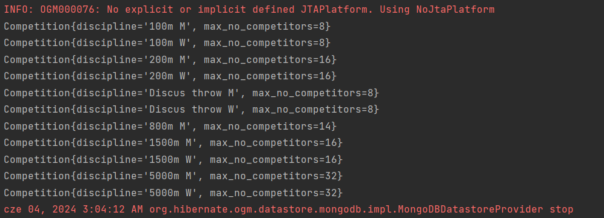  
Jest 11 rekordów, ponieważ siedem pierwszych zostało dodanych podczas tworzenia mityngu w Przemyślu. Cztery ostatnie to te, dodane teraz.


#### Operacje Read - klasa *CrudRead*  
Klasa ta wygląda analogicznie to klasy `CrudCreate`:  
```java
public class CrudRead {
    private final EntityManager entityManager;

    public CrudRead(EntityManager entityManager) {
        this.entityManager = entityManager;
    }

    // Funkcje zwracające listy poszczególnych obiektów, opisane szczegółowo poniżej.
}
```

1. Funkcje zwracające wszystkie encje dotyczące poszczególnych tabel:  
* `getAllAthletes` - zwraca wszystkich zawodników z bazy,  
* `getAllCoaches` - zwraca wszystkich trenerów,  
* `getAllMeetings` - zwraca wszystkie mityngi,  
* `getAllReports` - zwraca wszystkie zgłoszenia,  
* `getAllCompetitions` - zwraca wszystkie konkurencje wprowadzone do bazy.  
Wszystkie z tych funkcji działają w gruncie rzeczy tak samo - wykonują zapytanie zwracające wszystkie rekordy w danej tabeli.  
```java
public List<Athlete> getAllAthletes() {
    /**
     * Returns list of all athletes.
     */
    String query = "FROM Athlete";
    return entityManager.createQuery(query, Athlete.class).getResultList();
}

public List<Coach> getAllCoaches() {
    /**
     * Returns list of all coaches.
     */
    String query = "FROM Coach";
    return entityManager.createQuery(query, Coach.class).getResultList();
}

public List<Meeting> getAllMeetings() {
    /**
     * Returns list of all meetings.
     */
    String query = "FROM Meeting";
    return entityManager.createQuery(query, Meeting.class).getResultList();
}

public List<Report> getAllReports() {
    /**
     * Returns list of all reports.
     */
    String query = "FROM Report";
    return entityManager.createQuery(query, Report.class).getResultList();
}

public List<Competition> getAllCompetitions() {
    /**
     * Returns list of all competitions in all meetings.
     */
    String query = "FROM Competition";
    return entityManager.createQuery(query, Competition.class).getResultList();
}
```
Może pokażemy dla przykładu dane dotyczące wszystkich trenerów:  
```java
CrudRead crudRead = new CrudRead(entityManager);

List<Coach> allCoaches = crudRead.getAllCoaches();
for (Coach competition: allCoaches)
    System.out.println(competition.toString());
```

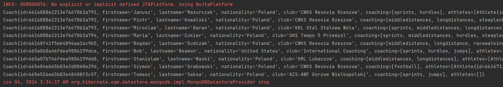  
Dokładniej:  
```js
Coach{
    id=6616888e2213e76670b2a791, firstname='Janusz', lastname='Mazurczak', nationality='Poland',
    club='CWKS Resovia Rzeszow', coaching=[sprints, hurdles],
    athletes=[
        Athlete{
            id=665e486365b83e53b4a75047, firstname='Wieslaw', lastname='Przystojny',
            /* Pozostałe dane zawodnika */
        },
        Athlete{
            id=665e64e465b83e5b10fce845, firstname='Oliwer', lastname='Wdowiak', 
            /* Pozostałe dane zawodnika */
        }
    ]
}

Coach{
    id=6616888e2213e76670b2a792, firstname='Piotr', lastname='Kowalski', nationality='Poland',
    club='CWKS Resovia Rzeszow', coaching=[middledistances, longdistances, steeplechase],
    athletes=[
        Athlete{
            id=661680852213e76670b2a784, firstname='Tomasz', lastname='Paja',
            /* Pozostałe dane zawodnika */
        },
        Athlete{
            id=661680852213e76670b2a785, firstname='Szymon', lastname='Paja', 
            /* Pozostałe dane zawodnika */
        }
    ]
}

Coach{
    id=6616888e2213e76670b2a793, firstname='Miroslaw', lastname='Baran', nationality='Poland',
    club='KKL Stal Stalowa Wola', coaching=[sprints, middledistances, longdistances], athletes=[]
}

Coach{
    id=6616888e2213e76670b2a794, firstname='Maria', lastname='Cukier', nationality='Poland',
    club='UKS Tempo 5 Przemysl', coaching=[sprints, middledistances, hurdles, steeplechase], athletes=[]
}

Coach{
    id=66168f41f5eb4896aa16c9b5, firstname='Bogdan', lastname='Dudczak', nationality='Poland',
    club='CWKS Resovia Rzeszow', coaching=[middledistance, longdistance, racewalking], athletes=[]
}

Coach{
    id=665a068a46fdea9886199dce, firstname='Bob', lastname='Beamon', nationality='United States',
    club='International Coaching', coaching=[sprints, hurdles, jumps],
    athletes=[
        Athlete{
            id=6616713e2213e76670b2a77f, firstname='Noah', lastname='Lyles',
            /* Pozostałe dane zawodnika */
        },
        Athlete{
            id=66165e1a2213e76670b2a778, firstname='Usain', lastname='Bolt',
            /* Pozostałe dane zawodnika */
        },
        Athlete{
            id=6616713e2213e76670b2a77d, firstname='Ferdinand', lastname='Omanyala',
            /* Pozostałe dane zawodnika */
        }
    ]
}

Coach{
    id=665a07b746fdea9886199dd8, firstname='Stanislaw', lastname='Wazki', nationality='Poland',
    club='KML Lubaczow', coaching=[middledistances, longdistances],
    athletes=[
        Athlete{
            id=6616856d2213e76670b2a78d, firstname='Michal', lastname='Bosy',
            /* Pozostałe dane zawodnika */
        }
    ]
}

Coach{
    id=665e04eb65b83e2d0060e29d, firstname='Szymon', lastname='Grabowski', nationality='Poland',
    club='CWKS Resovia Rzeszow', coaching=[football], athletes=[
        Athlete{
            id=6616713e2213e76670b2a77e, firstname='Christian', lastname='Coleman',
            /* Pozostałe dane zawodnika */
        }
    ]
}

Coach{
    id=665e526e65b83e48408f3c57, firstname='Tomasz', lastname='Saksa', nationality='Poland',
    club='AZS-AWF Gorzow Wielkopolski', coaching=[sprints, jumps], athletes=[]
}
```
2. Funkcje zwracające dane dotyczące zawodników należących do danego klubu lub trenujących u danego trenera:  
```java
public List<Athlete> getAthletesFromClub(@NotNull String club) {
    /**
     * @param club
     * Returns list of all athletes belonging to specified club.
     */
    List<Athlete> athletes = getAllAthletes();
    List<Athlete> results = athletes.stream().filter(a -> a.getClub() != null &&
                                            a.getClub().equals(club)).toList();
    return results;
}

public List<Athlete> getCoachesAthletes(@NotNull Coach coach) {
    /**
     * @param coach
     * Returns list of all athletes who train with specified coach.
     */
    List<Athlete> athletes = getAllAthletes();
    List<Athlete> results = athletes.stream().filter(a -> a.getCoach() != null &&
                                            a.getCoach().equals(coach)).toList();
    return results;
}
```
Funkcje te korzystają z funkcji `getAllAthletes`, a następnie filtrują uzyskany zbiór zawodników według warunków jakie mają spełniać.  
Przykładowe wywołanie:  
```java
System.out.println("Resovia athletes:");
List<Athlete> athletesResovia = crudRead.getAthletesFromClub("CWKS Resovia Rzeszow");
for (Athlete competition: athletesResovia)
    System.out.println(competition.toString());

Coach coach2 = (Coach) entityManager.createQuery(
    "FROM Coach c WHERE c.firstname = :firstname AND c.lastname = :lastname")
    .setParameter("firstname", "Bob")
    .setParameter("lastname", "Beamon")
    .getResultList().get(0);

System.out.println("\nBob Beamon's athletes:");
List<Athlete> athletesBobBeamon = crudRead.getCoachesAthletes(coach2);
for (Athlete competition: athletesBobBeamon)
    System.out.println(competition.toString());
```
Wyniki:  

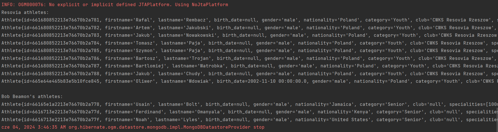

Widać, że wyniki są poprawne (zawodników Boba Beamona można porównać z zawodnikami w przykładzie dla funkcji `getCoaches`).  

3. Funkcje zwracające listy zgłoszonych zawodników według danych kryteriów:  
* brak kryteriów - `getAllMeetings`  
* zgłoszenia w ramach danego mityngu - `getReportsOfAllAthletesParticipatingInMeeting`  
* zgłoszenia w ramach danej dyscypliny w danym mityngu - `getReportsOfAllAthletesParticipatingInMeetingInDiscipline`  
* tylko potwierdzone lub złożone zgłoszenia w ramach danej dyscypliny w danym mityngu - `getReportsOfAllNotCancelledAthletesParticipatingInMeetingInDiscipline`  


```java
public List<Competition> getAllMeetingCompetitions(@NotNull Meeting meeting) {
    /**
     * @param meeting
     * Returns list of all competitions in the meeting.
     */
    return meeting.getCompetitions();
}

public List<Report> getReportsOfAllAthletesParticipatingInMeeting(@NotNull Meeting meeting) {
    /**
     * @param meeting
     * Returns all reports of athletes participating in the meeting.
     */
    List<Report> allReports = getAllReports();
    List<Report> results = new ArrayList<>();
    for (Report report: allReports) {
        if (report.getMeeting() != null && report.getMeeting().getId().equals(meeting.getId()))
            results.add(report);
    }
    return results;
}

public List<Report> getReportsOfAllAthletesParticipatingInMeetingInDiscipline(@NotNull Meeting meeting,
                                                                              @NotNull String discipline) {
    /**
     * @param meeting
     * @param competition
     * Returns all reports of athletes participating in the meeting in provided competition.
     */
    List<Report> allReportsFromThisMeeting = getReportsOfAllAthletesParticipatingInMeeting(meeting);
    List<Report> results = new ArrayList<>();
    for (Report report: allReportsFromThisMeeting) {
        if (report.getDiscipline() != null && report.getDiscipline().equals(discipline))
            results.add(report);
    }
    return results;
}

public List<Report> getReportsOfAllNotCancelledAthletesParticipatingInMeetingInDiscipline(
            @NotNull Meeting meeting, @NotNull String discipline)
{
    List<Report> allReportsInThisCompetitionInThisMeeting =
                getReportsOfAllAthletesParticipatingInMeetingInDiscipline(meeting, discipline);
    List<Report> results = new ArrayList<>();
    for (Report report: allReportsInThisCompetitionInThisMeeting) {
        if (report.getStatus() != null && !report.getStatus().equals("cancelled"))
            results.add(report);
    }
    return results;
}
```
Te funkcje wykorzystują siebie kolejno, z góry na dół, gdyż im dłuższa nazwa funkcji, tym bardziej zawężone wyniki zwraca. Niektóre z tych funkcji były już wykorzystywane powyżej, dlatego pokażemy wyniki tylko dla ostatniej z nich.  
Wybierzmy wszystkie zgłoszenia, które mają status *confirmed* lub *reported* i dotyczą zawodników startujących na zawodach w Przemyślu w biegu na 800m mężczyzn:  
```java
Meeting meeting = (Meeting) entityManager.createQuery(
    "FROM Meeting m WHERE m.name = :name")
    .setParameter("name", "20. Otwarte Mistrzostwa Przemysla")
    .getResultList().get(0);

List<Report> notCancelledInPrzemysl =
        crudRead.getReportsOfAllNotCancelledAthletesParticipatingInMeetingInDiscipline(meeting, "800m M");
for (Report report: notCancelledInPrzemysl)
    System.out.println(report.toString());
```
Wyniki:  

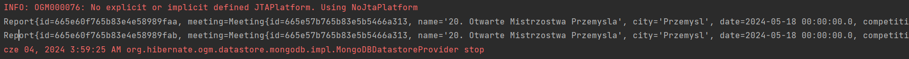  
```js
Report{
    id=665e60f765b83e4e58989faa,
    meeting=Meeting{
        id=665e57b765b83e5b5466a313, name='20. Otwarte Mistrzostwa Przemysla', city='Przemysl',
        /* Pozostałe dane mityngu */
    },
    athlete=Athlete{
        id=661680852213e76670b2a784, firstname='Tomasz', lastname='Paja',
        /* Pozostałe dane zawodnika */
    },
    coach=Coach{
        id=6616888e2213e76670b2a792, firstname='Piotr', lastname='Kowalski', nationality='Poland',
        club='CWKS Resovia Rzeszow', /* Pozostałe dane trenera */
    },
    discipline='800m M', status='reported', date=2024-06-04 02:33:59.786
}

Report{
    id=665e60f765b83e4e58989fab,
    meeting=Meeting{
        id=665e57b765b83e5b5466a313, name='20. Otwarte Mistrzostwa Przemysla', city='Przemysl',
        /* Pozostałe dane mityngu */
    },
    athlete=Athlete{
        id=661680852213e76670b2a785, firstname='Szymon', lastname='Paja',
        /* Pozostałe dane zawodnika */
    },
    coach=Coach{
        id=6616888e2213e76670b2a792, firstname='Piotr', lastname='Kowalski', nationality='Poland',
        club='CWKS Resovia Rzeszow', /* Pozostałe dane trenera */
    },
    discipline='800m M', status='confirmed', date=2024-06-04 02:33:59.843
}
```
A zmieńmy Tomasz Paji na *cancelled* korzystając z funkcji z klasy `CrudUpdate`:  
```java
Meeting meeting = (Meeting) entityManager.createQuery(
    "FROM Meeting m WHERE m.name = :name")
    .setParameter("name", "20. Otwarte Mistrzostwa Przemysla")
    .getResultList().get(0);

Report report = (Report) entityManager.createQuery(
    "FROM Report r WHERE r.athlete = :athlete AND r.meeting = :meeting")
    .setParameter("athlete", athlete1)
    .setParameter("meeting", meeting)
    .getResultList().get(0);

CrudUpdate crudUpdate = new CrudUpdate(entityManager);
crudUpdate.changeReportStatus(report, "cancelled");

List<Report> notCancelledInPrzemysl =
        crudRead.getReportsOfAllNotCancelledAthletesParticipatingInMeetingInDiscipline(meeting, "800m M");
for (Report report1: notCancelledInPrzemysl)
    System.out.println(report1.toString());
```
Wyniki:  

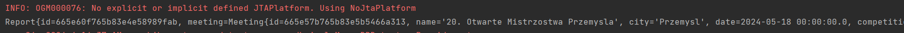
```js
Report{
    id=665e60f765b83e4e58989fab,
    meeting=Meeting{
        id=665e57b765b83e5b5466a313, name='20. Otwarte Mistrzostwa Przemysla', city='Przemysl',
        /* Pozostałe dane mityngu */
    },
    athlete=Athlete{
        id=661680852213e76670b2a785, firstname='Szymon', lastname='Paja',
        /* Pozostałe dane zawodnika */
    },
    coach=Coach{
        id=6616888e2213e76670b2a792, firstname='Piotr', lastname='Kowalski', nationality='Poland',
        club='CWKS Resovia Rzeszow', /* Pozostałe dane trenera */
    },
    discipline='800m M', status='confirmed', date=2024-06-04 02:33:59.843
}
```

#### Operacje Update - klasa *CrudUpdate*  
Implementacja klasy *CrudUpdate* prezentuje się następująco:
```java
package org.example.crud;

import org.example.Main;
import org.example.model.*;

import javax.persistence.EntityManager;
import javax.transaction.Transactional;

public class CrudUpdate {
    private final EntityManager entityManager;

    public CrudUpdate(EntityManager entityManager) {
        this.entityManager = entityManager;
    }

    @Transactional
    public void addAthleteToCoach(Athlete athlete, Coach coach) {
        /**
         * @param athlete
         * @param coach
         * Adds athlete to specified coach.
         */
        entityManager.getTransaction().begin();
        athlete.getCoach().getAthletes().remove(athlete);
        coach.addAthlete(athlete);
        athlete.setCoach(coach);
        entityManager.merge(coach);
        entityManager.merge(athlete);
        entityManager.getTransaction().commit();
    }

    @Transactional
    public void changeReportStatus(Report report, String newStatus) {
        /**
         * @param report
         * @param newStatus
         * Sets report status to new status.
         */
        if (report.getStatus().equals(newStatus)) {
            System.out.println("The status of report is already " + report.getStatus());
            return;
        }
        if (!newStatus.equals("reported") && !newStatus.equals("confirmed") &&
            !newStatus.equals("cancelled")) {
            System.out.println("Wrong status type! The available ones are: " +
                                "reported, confirmed, cancelled");
            return;
        }
        entityManager.getTransaction().begin();
        report.setStatus(newStatus);
        entityManager.merge(report);
        entityManager.getTransaction().commit();
    }

    @Transactional
    public void addCompetitionToMeeting(Meeting meeting, Competition competition) {
        /**
         * @param meeting
         * @param competition
         * Adds competition to specified meeting.
         */
        entityManager.getTransaction().begin();
        meeting.addCompetition(competition);
        entityManager.merge(meeting);
        entityManager.getTransaction().commit();
    }
}
```
Funkcja:
* `addAthleteToCoach(Athlete athlete, Coach coach)` - służy do przypisania zawodnika do trenera i trenera do zawodnika,
    ###### Przykład
    *Dodajmy do wcześniej utworzonego trenera Tomasza Saksy zawodnika Usaina Bolta:*
    ```java
    Coach saksa = (Coach) entityManager.createQuery(
            "FROM Coach c WHERE c.firstname = :firstname AND c.lastname = :lastname")
            .setParameter("firstname", "Tomasz")
            .setParameter("lastname", "Saksa")
            .getResultList().get(0);

    Athlete bolt = (Athlete) entityManager.createQuery(
            "FROM Athlete a WHERE a.firstname = :firstname AND a.lastname = :lastname")
            .setParameter("firstname", "Usain")
            .setParameter("lastname", "Bolt")
            .getResultList().get(0);

    crudUpdate.addAthleteToCoach(bolt, saksa);

    System.out.println(saksa.toString());
    ```
    *Wyniki:*
    ```js
    Coach{
        id=665e526e65b83e48408f3c57, firstname='Tomasz', lastname='Saksa', nationality='Poland',
        club='AZS-AWF Gorzow Wielkopolski', coaching=[sprints, jumps],
        athletes=[
            Athlete{
                id=66165e1a2213e76670b2a778, firstname='Usain', lastname='Bolt',
                birthDate=Fri Dec 12 00:00:00 CET 1986, gender='male', nationality='Jamaica',
                category='Senior', club='null', specialities=[100m, 200m, 4x100m],
                personalRecordsOutdoor={}, personalRecordsShortTrack={},
                coach=Coach{
                    id=665e526e65b83e48408f3c57, firstname='Tomasz', lastname='Saksa',
                    nationality='Poland', club='AZS-AWF Gorzow Wielkopolski',
                    coaching=[sprints, jumps]
                }
            }
        ]
    }
    ```
    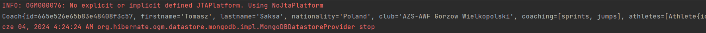

* `changeReportStatus(Report report, String newStatus)` - służy do zmiany statusu zgłoszenia
  *Działanie funkcji zostało zaprezentowane w przykładzie dla funkcji `getReportsOfAllNotCancelledAthletesParticipatingInMeetingInDiscipline()`.*
* `addCompetitionToMeeting(Meeting meeting, Competition competition)` - służy do dodania konkurencji do zawodów.

#### Operacje Delete - klasa *CrudDelete*
Implementacja klasy *CrudDelete* prezentuje się następująco:
```java
package org.example.crud;

import org.example.model.*;
import org.jetbrains.annotations.NotNull;

import javax.persistence.EntityManager;
import javax.transaction.Transactional;
import java.util.List;

public class CrudDelete {
    private final EntityManager entityManager;

    public CrudDelete(EntityManager entityManager) {
        this.entityManager = entityManager;
    }

    @Transactional
    public void deleteCoach(@NotNull Coach coach) {
        Coach foundCoach = entityManager.find(Coach.class, coach.getId());
        if (foundCoach != null) {
            entityManager.getTransaction().begin();
            for (Athlete athlete: coach.getAthletes()) {
                athlete.setCoach(null);
                entityManager.merge(athlete);
            }
            entityManager.remove(foundCoach);
            entityManager.getTransaction().commit();
            System.out.println("Coach has been deleted.");
        }
        else
            System.out.println("There is no such coach in the database!");
    }

    @Transactional
    public void deleteReport(@NotNull Report report) {
        Report foundReport = entityManager.find(Report.class, report.getId());
        if (foundReport != null) {
            System.out.println("There is no such report in the database!");
            entityManager.getTransaction().begin();
            entityManager.remove(foundReport);
            entityManager.getTransaction().commit();
            System.out.println("Report has been deleted.");
        }
        else
            System.out.println("There is no such report in the database!");
    }

    @Transactional
    public void deleteMeeting(@NotNull Meeting meeting) {
        Meeting foundMeeting = entityManager.find(Meeting.class, meeting.getId());
        List<Report> reports =
                new CrudRead(entityManager).getReportsOfAllAthletesParticipatingInMeeting(meeting);
        
        if (reports.size() > 0) {
            System.out.println("There are reports for this meeting so you cannot delete it!");
            return;
        }
        if (foundMeeting != null) {
            System.out.println("There is no such meeting in the database!");
            entityManager.getTransaction().begin();
            entityManager.remove(foundMeeting);
            entityManager.getTransaction().commit();
            System.out.println("Meeting has been deleted.");
        }
        else
            System.out.println("There is no such meeting in the database!");
    }

    @Transactional
    public void deleteAthlete(@NotNull Athlete athlete) {
        Athlete foundAthlete = entityManager.find(Athlete.class, athlete.getId());
        List<Report> reports = new CrudRead(entityManager).getAllReports();
        for (Report report: reports) {
            if (report.getAthlete().equals(athlete)) {
                System.out.println("You cannot delete this athlete, " +
                                "because it is reported for some meetings!");
                return;
            }
        }
        if (foundAthlete != null) {
            System.out.println("There is no such athlete in the database!");
            entityManager.getTransaction().begin();
            entityManager.remove(foundAthlete);
            entityManager.getTransaction().commit();
            System.out.println("Athlete has been deleted.");
        }
        else
            System.out.println("There is no such athlete in the database!");
    }

    @Transactional
    public void removeCompetitionFromMeeting(@NotNull Meeting meeting, @NotNull Competition competition) {
        Meeting foundMeeting = entityManager.find(Meeting.class, meeting.getId());
        if (foundMeeting == null) {
            System.out.println("There is no such meeting in the database!");
            return;
        }
        List<Report> reports = new CrudRead(entityManager)
                .getReportsOfAllAthletesParticipatingInMeetingInDiscipline(
                    meeting, competition.getDiscipline()
                );

        if (reports.size() > 0) {
            System.out.println("There are reports for this competition in this meeting " +
                                "so you cannot delete it!");
            return;
        }

        if (meeting.getCompetitions().contains(competition)) {
            entityManager.getTransaction().begin();
            meeting.removeCompetition(competition);
            entityManager.merge(meeting);
            entityManager.getTransaction().commit();
            System.out.println("Competition has been deleted from meeting.");
        }
        else
            System.out.println("There is no such competition planned in provided meeting.");
    }
}
```
Funkcja:
* `deleteCoach(@NotNull Coach coach)` - służy do usuwania trenera z bazy,
  ###### Przykład
  *Usuniemy trenera Tomasza Saksę z bazy danych*
  ```java
    Coach saksa = (Coach) entityManager.createQuery(
            "FROM Coach c WHERE c.firstname = :firstname AND c.lastname = :lastname")
            .setParameter("firstname", "Tomasz")
            .setParameter("lastname", "Saksa")
            .getResultList().get(0);
    CrudDelete crudDelete = new CrudDelete(entityManager);
    crudDelete.deleteCoach(saksa);
    List<Coach> coachesLeft = crudRead.getAllCoaches();
    for (Coach c: coachesLeft)
        System.out.println(c.toString());
  ```
  *Wyniki:*
  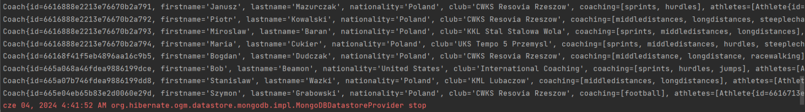
  *Pozostałe funkcje działają analogicznie i przykłady są bardzo pododne.*
* `deleteReport(@NotNull Report report)` - służy do usuwania zgłoszenia z bazy,
* `deleteMeeting(@NotNull Meetin meeting)` - służy do usuwania mityngu z bazy,
* `deleteAthlete(@NotNull Athlete athlete)` - służy do usuwania zawodnika z bazy,
* `removeCompetitionFromMeeting(@NotNull Meeting meeting, @NotNull Competition competition)` - służy do usuwania konkurencji z zawodów.
